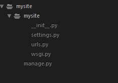
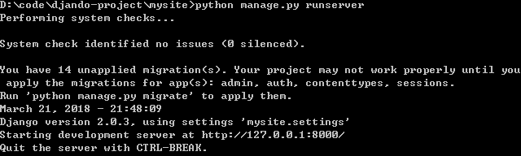

## 创建项目以及投票app
本节我们将由一个基本的投票系统开始，来走进Django的世界。

投票系统包含两部分：

* 一个公共的投票站点，让人们看到投票项以及对其进行投票
* 一个管理站点，让管理员对投票系统进行管理

在开始之前，我们需要进行如下的准备工作：

* Python安装，在python官网(https://www.python.org/downloads/) 进行下载安装（安装步骤请参考官方文档）
* Django的安装：执行 `$ pip install django` 进行在线安装,安装完之后可输入`$ python -m django --version`查看diango版本，以此验证安装成功与否

本系统种目前使用的是`python 3.6.4`和 `django 2.0.3`

#### 创建项目
如果这是你第一次使用django，你将要注意一些初始话的安装以及命名规则，你将使用命令行自动生成一些代码来实现一个django项目--包括数据库的设置等等。

打开命令行，进入到你想保存代码的路径，执行如下命令：

`$ django-admin startproject mysite`

上述命令执行完之后在当前目录生成一个mysite的文件夹，通过`startproject`命令生成文件夹目录如下：

这些文件都是：

* 最外层的mysite/根目录仅仅是一个容器，用来放置你的项目，它的命名对于Django来说可以任意命名，你可以改成任意你想要的名称。
* manage.py: 一个命令行的工具，让你用各种方式与Django项目进行交互。
* 内层的mysite/是存放你项目中python包的地方，它的名称就是python包的名称，你可以在内部import任意的包，比如（`mysite.urls`）。
* mysite/__init__.py:一个空文件，用来告诉python，当前的目录是一个python的包。
* mysite/settings.py:对当前的python项目进行设置/配置。
* mysite/urls.py：当前项目种URL定义的地方。
* mysite/wsgi.py：WSGI兼容的Web服务器为您的项目提供服务的入口

#### 启动开发模式的服务
`$ python manage.py runserver`

你将会看到命令行中的输出如下：

如上图，你已经开启了一个Django的开发模式的服务，一个由python写的轻量级的web服务，现在通过浏览器打开 http://127.0.0.1:8000/ 你将看到一个“Congratulations!” 的页面，说明服务已经正常运行了。